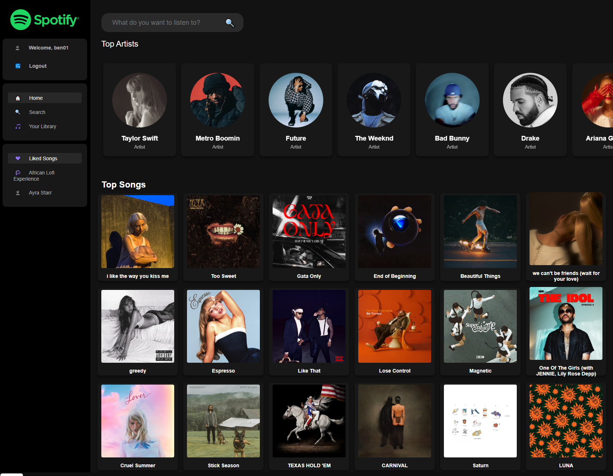

# Spotify-fullstack-app

## How to run the Web
```

pip install -r requirement.txt

cd ./backend/spotify

python manage.py runserver
```

#### Spotify like Full Stack Web Application


#### ${\color{blue} Tech Flow}$
##### ${\color{red}with Django + Python Request + Postgres + RapidAPI }$


### ${\color{blue} Demo}$

### 1. Login & Regist Page


### 2. Home Page
#### Home page shown with top artist and top 18 tracks

#### 2.1 Click one of top artists with example shown with Weekend
#### with his popular songs with click_count and song duration


#### 2.2 Click one of top tracks with example shown with Magenetic with the time-duration
#### And you can choose pause and continue to play
#### or +5 seconds and -5 seconds

### 3. Search Page
#### example shown with search-bar input=drake


